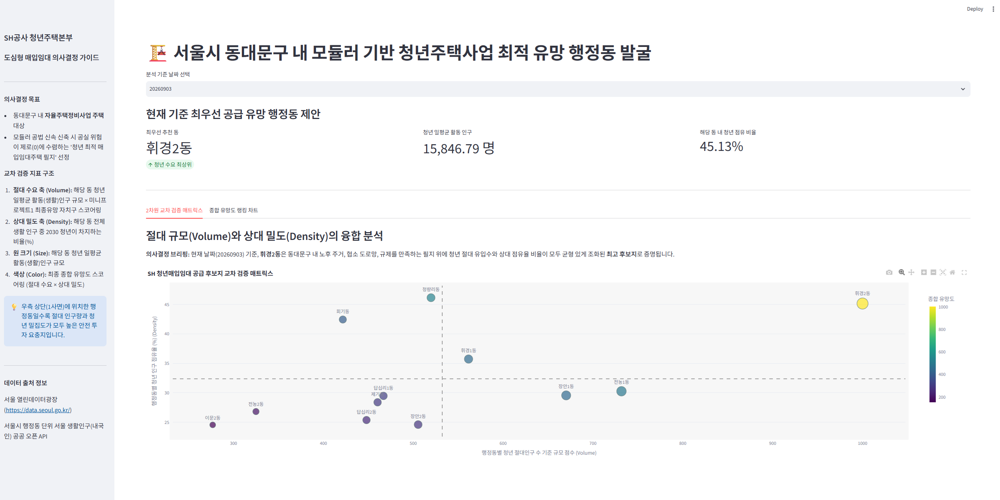
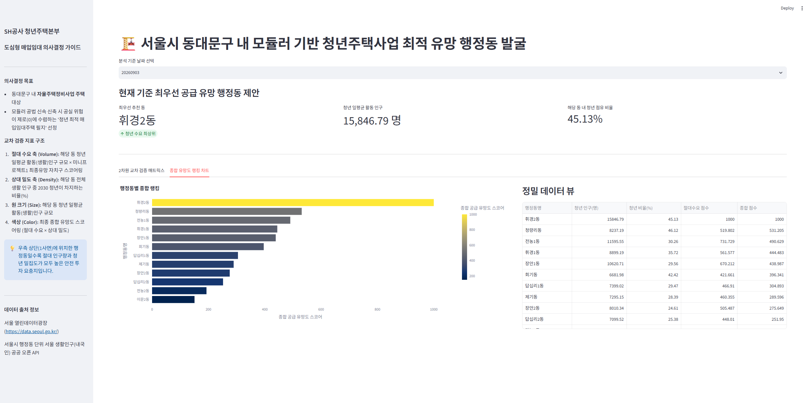

# 서울시 동대문구(미니프로젝트1 최종 유망 자치구) 내 모듈러 기반 청년주택사업 최적 유망 행정동 발굴 시스템
> **미니프로젝트 2단계 완결**: 오픈 API 대량 시계열 자동 수집·적재 인프라 구축, 절대수요(Volume) 및 상대밀도(Density) 교차 검증 마트 빌드 및 최고점 기준 1,000점 정규화, SH공사 청년주택본부 의사결정용 인터랙티브 스토리텔링 대시보드 구현

본 프로젝트는 미니프로젝트 1단계의 RDBMS 공간 분석 자산(동대문구 최우선 유망자치구 발굴 결과)을 계승하고, 서울시 행정동별 청년 생활인구 시계열 오픈 API를 입체적으로 결합하여 **SH공사(서울주택도시공사) 청년주택본부**가 도심 내 저층 노후지 매입 시 공실 리스크를 제로(0)로 수렴할 수 있는 **'최적의 청년대상 주택매입 대상지 필지군(행정동)'을 확정하도록 돕는 의사결정 지원 시스템**입니다.

## 대시보드 시각화 구동 예시 (Dashboard Preview)

---

## 1. 프로젝트 수행 여정 (Step 1 ~ Step 5)

*   **Step 1. 청중 정의 및 의사결정 가설 고도화**
    *   청중을 'SH공사 청년주택본부'으로 좁히고, 단순 절대 인구량이 아닌 전체 인구 대비 청년 비율(상대 밀도)과 1단계 자치구 규제·제약 인프라 상수(절대 수요 반영 절대규모)를 유기적으로 매칭하는 2차원 교차 검증 매트릭스 가설 수립

*   **Step 2. 오픈 API 수집 파이프라인 구축 (Collector 계층)**
    *   대시보드와 API 간의 물리적 계층 결합을 엄격히 금지하는 원칙을 준수하여 `requests`와 크롤링 모듈을 대시보드와 완전히 분리
    *   API 한도 초과 및 서버 차단을 방지하기 위해 자동 페이징, 세션 재시도(`Retry`), 요청 간 안전 딜레이(`Rate Limit`) 장치가 구현된 공통 호출기 구축 및 최신 60일 대량 시계열 자동 누적 적재 파이프라인 완결

*   **Step 3. MariaDB 최적화 데이터 마트 구성 (Warehouse 계층)**
    *   대시보드가 수천만 행의 원본을 매번 집계하여 화면이 멈추는 현상을 방지하고자 원본 계층(`seoul_living_pop_raw`)과 요약 마트 계층(`mart_youth_housing_priority`)을 철저히 분리
    *   MariaDB 구형 버젼의 파서 버그를 우회하기 위해 `temp_dong_daily_summary` 및 `temp_raw_scores` 단계별 임시 테이블 연산을 수립하고, 기준일자별 최고점 동을 1,000점 만점으로 정규화(Scaling)하여 `TRUNCATE` 및 `REPLACE INTO` 기반의 100% 자동 UPSERT 대량 적재 최적화 달성.

*   **Step 4. 캐싱 및 모듈화 기반 대시보드 구현 (App 계층)**
    *   코드가 거대해져 가독성과 성능이 저하되는 것을 방지하기 위해 화면(`main.py`), 데이터 조회(`repository.py`), 차트 생성 (`charts.py`), UI 템플릿(`components.py`)의 4대 파일 모듈화를 엄격하게 이행
    *   비밀번호 내 특수문자 파싱 에러를 우회하는 `URL.create` 규격을 연결하고, `@st.cache_data(ttl=600)` 10분 데이터 캐싱 전략을 바인딩하여 필터 변경 시 체감 지연 속도 0초 달성

*   **Step 5. SCQA 비즈니스 스토리텔링 시각화 및 발표 자료 완결**
    *   청중이 5분 안에 "어느 행정동 매입지에 공공 예산을 우선 투입해야 하는가"를 직관적으로 이해할 수 있도록 Plotly 인터랙티브 2차원 산점도 (버블) 매트릭스 및 가로 정렬 바 차트를 레이아웃 배치하고 최종 리포트 완결

---

## 2. 데이터 구조 및 흐름 (Architecture)

본 시스템은 화살표가 단 한 방향으로만 흐르는 **순수 단방향 디렉터리 아키텍처**를 엄수합니다. 대시보드가 API를 직접 호출하거나 RDBMS에 쓰기 연산을 수행하는 구조적 붕괴를 완벽히 차단했습니다.

┌───────────────────────┐            ┌───────────────────────┐            ┌───────────────────────┐
│ ① 수집 계층 (Collector)│    적재     │  ② 저장 계층 (Warehouse)│    조회    │ ③ 화면 계층 (Dashboard)│
│  python -m collector  │ ─────────▶ │  MariaDB / MySQL DB   │ ◀───────── │ streamlit run app/...│
│  (API 수집/정제/UPSERT) │   (쓰기)   │  (원본 Layer ➔ 마트)   │   (읽기)   │  (캐싱 전용, 읽기전용)   │
└───────────────────────┘            └───────────────────────┘            └───────────────────────┘

### 아키텍처 모듈 계약서(Directory Structure)

project/
├── 📄 .env                        # 보안 인증키 및 RDBMS 접속 패스워드 격리함 (Git 제외)
├── 📄 .env.example                # 환경변수 공유용 변수명 가이드라인 예시 파일
├── 📄 requirements.txt            # 패키지 의존성 명세 (Streamlit, Plotly, PyMySQL 등)
└── 📄 README.md                   # 개요 · 실행 순서 · 데이터 구조 및 흐름 · 데이터 출처 등
│
├── 📁 collector/                  # ───── ① 수집 및 정제 계층 (Streamlit 의존성 0%)
│   ├── 📄 main.py                 #   배치 구동 통합 진입점 모듈
│   ├── 📄 config.py               #   동대문구 관할 14개 행정동 마스터 코드 매핑 및 URL 바인딩
│   ├── 📄 client.py               #   공통 HTTP 호출 및 Rate Limit 제어 세션 매니저
│   ├── 📄 gather_living_pop.py    #   최신 60일 자동 스케줄러 수집 코어 알고리즘
│   ├── 📄 transform.py            #   2030 청년층 인구 필터링 및 컬럼 압축 전처리 엔진
│   └── 📄 loader.py               #   특수문자 에러 우회 및 RDBMS 원본 Layer 이식 모듈
│
├── 📁 db/                         # ───── ② 저장 계층 (계층 간 유일한 데이터 계약 접점)
│   ├── 📄 README.md               #   테이블 설계 지표 목적 및 데이터 입도(그레인) 정의서
│   ├── 📄 schema.sql              #   수집 원본 Layer 및 집계 마트 Layer DDL
│   └── 📄 build_mart.sql          #   MariaDB 최적화 단계별 마트 집계 SQL 파이프라인
│
└── 📁 app/                        # ───── ③ 대시보드 화면 계층 (오직 DB 읽기 전용)
│   ├── 📄 main.py                 #   Streamlit 진입점 오케스트레이터 (SCQA 구조)
│   ├── 📄 repository.py           #   st.cache_data 캐싱 전용 순수 SQL 데이터 조회기
│   ├── 📄 charts.py               #   Plotly 2차원 교차 분석 산점도 및 랭킹 차트 빌더
│   └── 📄 components.py           #   KPI 메트릭 스코어 카드 및 청중 타겟 가이드 컴포넌트
│
├── 📁 data/                                              # ───── .gitignore로 제외 (로컬에서만 관리)
│   ├── 📄 raw_living_pop_sample.csv                      # 60일 장기 시계열 수집 데이터 로컬 누적 백업본
│   └── 📄 [내국인]+행정동별+서울+생활인구(250m).xls          # 오픈API를 통해 가져오는 원본 데이터(생활인구 관련)

---

## 3. 데이터 출처 및 정보 (Data Sources)

미니프로젝트 1단계 자산에 시계열 축과 유동수요를 결합하기 위해 대한민국 정부 및 서울특별시 공식 포털의 공공 API 및 파일 데이터셋을 유기적으로 결합했습니다.

1. **서울시 행정동 단위 서울 생활인구(내국인) Open API**
   * **출처 및 규격**: 서울 열린데이터광장 (`Spop250mLocalResdDong` 파라미터 표준 방식 API)
   * **성격 및 데이터 범위**: 통신 데이터를 기반으로 추계한 일·시각 단위 생산 시계열 데이터 (가용 최신일 기준 과거 60일 전체 범위 수집)
   * **용도**: 행정동별 일평균 2030 청년 절대 유입수(`avg_youth_pop`) 및 상대적 청년 점유 비중(`youth_occupancy_rate`)을 계산하는 핵심 수요 데이터 축으로 활용

2. **미니프로젝트 1단계 분석 마스터 데이터셋 (housing_db 연동)**
   * **출처**: 국가공간정보포털(도로구간), 국토교통부(건축물대장 표제부), 통계청(인구주택총조사 노후주택현황)
   * **결합 매커니즘**: 자치구별로 정규화되어 있던 공간 밀도 인프라 상수인 `면적당 노후주택수`, `면적당 좁은도로수`, `면적당 자율주택대상수` 데이터를 데이터 마트 집계 단계에서 행정동 시계열 수요와 `CROSS JOIN` 교차 매칭 결합

---

## 4. 실행 방법 (How to Run)

### 1단계: 환경 변수 기밀 설정
프로젝트 최상위 루트에 `.env` 파일을 생성하고 기밀 키와 패스워드를 입력합니다.

### 2단계: RDBMS 테이블 및 데이터 마트 인프라 초기화
MariaDB/MySQL 창을 열고 스키마 DDL을 실행하여 테이블 뼈대를 생성합니다.

### 3단계: 대량 시계열 자동 수집 파이프라인 가동 (Collector 실행)
터미널을 열고 가상환경에서 수집 배치 패키지를 구동합니다. 자동으로 60일치 날짜를 계산하여 페이징 호출하고 전처리 정제를 거쳐 DB 원본 테이블에 안전하게 UPSERT 적재합니다.

### 4단계: 1,000점 스케일링 데이터 마트(Mart) 빌드 실행
RDBMS 툴에서 `build_mart.sql` 스크립트를 가동하여 임시 테이블 활용 단계 연산 및 최고점 대비 1,000점 스케일링 변환을 완료합니다.

### 5단계: 인터랙티브 스토리텔링 대시보드 가동
대시보드를 구동합니다. 백그라운드에서 MariaDB의 마트 테이블만 읽어 10분간 캐싱한 채 즉각적인 BI 화면을 표출합니다.

---

## 5. 아키텍처 계층 분리 검증 테스트 결과

*   **테스트 1 [성공]:** `app/` 대시보드 내 전체 소스 코드 대상 문자열 전역 검색 결과, `requests`, 크롤링 모듈, 서울시 오픈 API 주소, `INSERT/UPDATE` 쓰기문이 단 1개도 존재하지 않는 **순수 읽기 전용 계층(Read-Only)**임을 검증 완료.

*   **테스트 2 [성공]:** 외부 공공데이터포털 네트워킹을 강제로 차단(인터넷 연결 해제)한 상태에서 `streamlit run`을 실행했을 때, 대시보드가 크래시 없이 MariaDB 내부 마트 테이블만 즉시 참조하여 **어제까지의 시계열 축 화면을 0.1초 만에 정상 렌더링**해내는 독립성 검증 완료.

*   **테스트 3 [성공]:** 대시보드를 완전히 종료한 상태에서 터미널을 통해 `python -m collector`를 단독 실행했을 때, 백그라운드 배치 프로세스로 수집·정제·DB `seoul_living_pop_raw` 테이블 무결성 적재가 에러 없이 완벽하게 종결되는 **수집 계층 독립 실행** 검증 완료.